# Creación y asignación de roles y perfiles en Oracle DB
https://github.com/CarlosM01/rdb_eval4

### Integrantes:
* Diego Reyes
* Carlos Mac-Iver

### Sección:
* AP-172-N2

## Índice

1. **Introducción**  
   - Objetivo del documento  

2. **Diagramas**  
   - Tablas  
   - Perfiles  
   - Roles  

3. **Configuración inicial**  
   3.1. Creación del contenedor e instalación de Oracle DB  
   3.2. Verificación del estado de la base de datos  
   3.3. Conexión a la base de datos  

4. **Creación de tablas**  
   - Detalle de las tablas con sus atributos y relaciones  

5. **Definición de roles y perfiles**  
   5.1. Creación de usuarios  
   5.2. Definición de roles  
   5.3. Creación de perfiles  
   5.4. Asignación de roles y perfiles  
   5.5. Guardar cambios  

6. **Testing**  
   - Verificación de conexión a la base de datos  
   - Pruebas de acceso y manipulación de datos con el usuario **C##medico00**  
     - Consulta de tablas  
     - Inserción de datos  
     - Actualización de datos
     - Verificación de privilegios
     - Verificación de límite de sesiones simultáneas  

7. **Referencias**  
   - Enlaces a recursos y documentación utilizados  


---
## Introducción
Este documento describe el proceso de configuración, creación de tablas, definición de roles y perfiles, y pruebas de acceso a una base de datos Oracle, creada con el contenedor Podman y la imagen oficial de Oracle Database. El objetivo es gestionar de manera eficiente la información relacionada con pacientes, su historia clínica, procedimientos médicos, exámenes, insumos, transporte y finanzas en un sistema hospitalario. Se detallan los pasos para la creación de tablas, asignación de privilegios y roles a usuarios específicos, así como las pruebas de inserción, actualización y eliminación de datos desde diferentes perspectivas de usuario. Esta implementación es una base sólida para la gestión de datos en un entorno de salud, asegurando que los roles y perfiles de usuarios estén correctamente configurados según las responsabilidades de cada uno.

## Diagramas
### Tablas
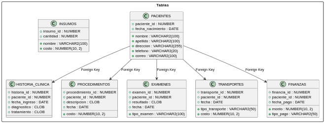
### Perfiles

### Roles 
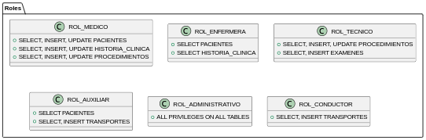

Diagramas creados con PlantUML. Código fuente en el repositorio del proyecto.

## Configuración inicial
1. Crear contenedor e instalar imagen de Oracle DB
```bash
podman run -d --name mydb \
-p 1521:1521 \
-e ORACLE_PWD=SystemPass123 \
-v ./data:/database \
container-registry.oracle.com/database/free:latest
```
### Flags
* -p: Puertos
* -e: Contraseña para el usuario System
* -v: Ruta del volumen donde se almacenarán los datos
* Ruta de la imagen, si no se especifica la versión se usará la última por defecto

### Consideraciones
* Como protocolo de seguridad se sugiere ingresar las contraseñas como variables de entorno o desactivar temporalmente el historial de la terminal.
* Crear un volumen es opcional pero recomendado, sirve para asegurar la persistencia de los datos al cerrar el contenedor. Si se omite este paso, la información almacenada sería volátil. 
* Para más indormación revisar: [Oracle Container Registry](https://container-registry.oracle.com/ords/f?p=113:4:105468287933418:::4:P4_REPOSITORY,AI_REPOSITORY,AI_REPOSITORY_NAME,P4_REPOSITORY_NAME,P4_EULA_ID,P4_BUSINESS_AREA_ID:1863,1863,Oracle%20Database%20Free,Oracle%20Database%20Free,1,0&cs=3AwzWwTBO9ge-PN-FJMP6CmQIpWJeaPM4t9K_xjdv0tus0fX1UchjuxAxgeVBrAvzu6mTDU_YC5ddFcwUKIiagg)

---
2. Comprobamos que la base de datos esté funcionando
```bash
podman ps
```
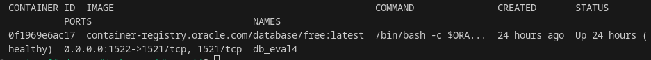

---
3. Conectarse a la base de datos con SQL Developer
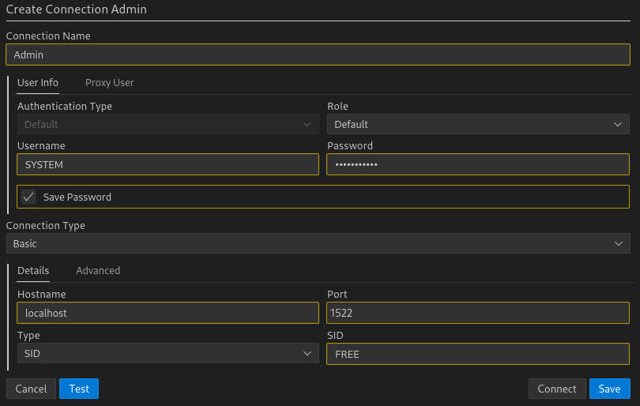

Para este experimento ejecutamos SLQ Developer desde VS Code.

* Revisar: [SQL Developer Dowloads](https://www.oracle.com/cl/database/sqldeveloper/technologies/download/)

---
## Creación de tablas

### Usuario: SYSTEM

 ```SQL
CREATE TABLE PACIENTES (
    paciente_id NUMBER PRIMARY KEY,
    nombre VARCHAR2(100) NOT NULL,
    apellido VARCHAR2(100) NOT NULL,
    fecha_nacimiento DATE NOT NULL,
    direccion VARCHAR2(255),
    telefono VARCHAR2(20),
    correo VARCHAR2(100)
);

CREATE TABLE HISTORIA_CLINICA (
    historia_id NUMBER PRIMARY KEY,
    paciente_id NUMBER NOT NULL,
    fecha_ingreso DATE NOT NULL,
    diagnostico CLOB,
    tratamiento CLOB,
    FOREIGN KEY (paciente_id) REFERENCES PACIENTES(paciente_id)
);

CREATE TABLE PROCEDIMIENTOS (
    procedimiento_id NUMBER PRIMARY KEY,
    paciente_id NUMBER NOT NULL,
    descripcion CLOB NOT NULL,
    fecha DATE NOT NULL,
    costo NUMBER(10, 2),
    FOREIGN KEY (paciente_id) REFERENCES PACIENTES(paciente_id)
);

CREATE TABLE EXAMENES (
    examen_id NUMBER PRIMARY KEY,
    paciente_id NUMBER NOT NULL,
    tipo_examen VARCHAR2(100) NOT NULL,
    resultado CLOB,
    fecha DATE NOT NULL,
    FOREIGN KEY (paciente_id) REFERENCES PACIENTES(paciente_id)
);

CREATE TABLE INSUMOS (
    insumo_id NUMBER PRIMARY KEY,
    nombre VARCHAR2(100) NOT NULL,
    cantidad NUMBER,
    costo NUMBER(10, 2)
);

CREATE TABLE TRANSPORTES (
    transporte_id NUMBER PRIMARY KEY,
    paciente_id NUMBER NOT NULL,
    tipo_transporte VARCHAR2(50),
    fecha DATE NOT NULL,
    costo NUMBER(10, 2),
    FOREIGN KEY (paciente_id) REFERENCES PACIENTES(paciente_id)
);

CREATE TABLE FINANZAS (
    financia_id NUMBER PRIMARY KEY,
    paciente_id NUMBER NOT NULL,
    monto NUMBER(10, 2),
    tipo_pago VARCHAR2(50),
    fecha_pago DATE NOT NULL,
    FOREIGN KEY (paciente_id) REFERENCES PACIENTES(paciente_id)
);
```

## Definición de Roles y Perfiles

1. Creación de usuarios
```SQL
-- Crear usuarios con contraseñas predeterminadas
CREATE USER C##medico00 IDENTIFIED BY O7Qw5XUJiduTk;
CREATE USER C##enfermera00 IDENTIFIED BY s4STGJ7JssK8gL;
CREATE USER C##tecnico00 IDENTIFIED BY zHrd6erELU9XxJ;
CREATE USER C##auxiliar00 IDENTIFIED BY YFOvj4bMyx7co2;
CREATE USER C##administrativo00 IDENTIFIED BY QANpFp5A1bdHAr;
CREATE USER C##conductor00 IDENTIFIED BY nNeaPic5cG3ge6;

-- Asignar privilegios básicos para conexión
GRANT CONNECT TO C##medico00, C##enfermera00, C##tecnico00, C##auxiliar00, C##administrativo00, C##conductor00;
```
En ningun caso las contraseñas deberían estar expuestas si se tratara de un entorno de producción.

Al tratarse de un experimento, se muestran las contraseñas en texto plano dentro del script, sólo para mantener la claridad de la explicación. Ingresar los datos sensibles mediante un cliente como SQL Plus evitaría que las contraseñas se expongan accidentalmente a terceros.

---
2. Definición de roles
```SQL
-- Crear roles para los distintos tipos de personal
CREATE ROLE C##ROL_MEDICO;
CREATE ROLE C##ROL_ENFERMERA;
CREATE ROLE C##ROL_TECNICO;
CREATE ROLE C##ROL_AUXILIAR;
CREATE ROLE C##ROL_ADMINISTRATIVO;
CREATE ROLE C##ROL_CONDUCTOR;

-- Asignar privilegios específicos a cada rol según funciones
-- C##ROL_MEDICO: Acceso a todas las tablas relacionadas con pacientes, historia clínica, procedimientos, etc.
GRANT SELECT, INSERT, UPDATE ON PACIENTES TO C##ROL_MEDICO;
GRANT SELECT, INSERT, UPDATE ON HISTORIA_CLINICA TO C##ROL_MEDICO;
GRANT SELECT, INSERT, UPDATE ON PROCEDIMIENTOS TO C##ROL_MEDICO;

-- C##ROL_ENFERMERA: Acceso solo a la visualización de pacientes y su historia clínica
GRANT SELECT ON PACIENTES TO C##ROL_ENFERMERA;
GRANT SELECT ON HISTORIA_CLINICA TO C##ROL_ENFERMERA;

-- C##ROL_TECNICO: Acceso a procedimientos y exámenes
GRANT SELECT, INSERT, UPDATE ON PROCEDIMIENTOS TO C##ROL_TECNICO;
GRANT SELECT, INSERT ON EXAMENES TO C##ROL_TECNICO;

-- C##ROL_AUXILIAR: Acceso limitado a información de pacientes y transportes
GRANT SELECT ON PACIENTES TO C##ROL_AUXILIAR;
GRANT SELECT, INSERT ON TRANSPORTES TO C##ROL_AUXILIAR;

-- C##ROL_ADMINISTRATIVO: Acceso completo a todas las tablas de la base de datos
GRANT ALL PRIVILEGES ON PACIENTES TO C##ROL_ADMINISTRATIVO;
GRANT ALL PRIVILEGES ON HISTORIA_CLINICA TO C##ROL_ADMINISTRATIVO;
GRANT ALL PRIVILEGES ON PROCEDIMIENTOS TO C##ROL_ADMINISTRATIVO;
GRANT ALL PRIVILEGES ON EXAMENES TO C##ROL_ADMINISTRATIVO;
GRANT ALL PRIVILEGES ON INSUMOS TO C##ROL_ADMINISTRATIVO;
GRANT ALL PRIVILEGES ON TRANSPORTES TO C##ROL_ADMINISTRATIVO;
GRANT ALL PRIVILEGES ON FINANZAS TO C##ROL_ADMINISTRATIVO;

-- C##ROL_CONDUCTOR: Acceso solo a la tabla de transportes
GRANT SELECT, INSERT ON TRANSPORTES TO C##ROL_CONDUCTOR;
```

---
3. Creación de perfiles
```SQL
-- Crear perfiles para limitar recursos
CREATE PROFILE C##perfil_medico LIMIT
    SESSIONS_PER_USER 3
    IDLE_TIME UNLIMITED
    CONNECT_TIME UNLIMITED;

CREATE PROFILE C##perfil_enfermera_tecnico LIMIT
    SESSIONS_PER_USER 2
    IDLE_TIME 30
    CONNECT_TIME 480; -- 8 horas en minutos

CREATE PROFILE C##perfil_auxiliar_conductor LIMIT
    SESSIONS_PER_USER 1
    IDLE_TIME 30
    CONNECT_TIME 240; -- 4 horas en minutos

CREATE PROFILE C##perfil_administrativo LIMIT
    SESSIONS_PER_USER 3
    IDLE_TIME UNLIMITED
    CONNECT_TIME UNLIMITED;
```

---
4. Asignación de roles y perfiles
```SQL
-- Asignar perfiles a los usuarios
ALTER USER C##medico00 PROFILE C##perfil_medico;
ALTER USER C##enfermera00 PROFILE C##perfil_enfermera_tecnico;
ALTER USER C##tecnico00 PROFILE C##perfil_enfermera_tecnico;
ALTER USER C##auxiliar00 PROFILE C##perfil_auxiliar_conductor;
ALTER USER C##conductor00 PROFILE C##perfil_auxiliar_conductor;
ALTER USER C##administrativo00 PROFILE C##perfil_administrativo;

-- Asignar roles a los usuarios
GRANT C##ROL_MEDICO TO C##medico00;
GRANT C##ROL_ENFERMERA TO C##enfermera00;
GRANT C##ROL_TECNICO TO C##tecnico00;
GRANT C##ROL_AUXILIAR TO C##auxiliar00;
GRANT C##ROL_ADMINISTRATIVO TO C##administrativo00;
GRANT C##ROL_CONDUCTOR TO C##conductor00;
```

---
5. Guardar cambios
```SQL
COMMIT;
```
---
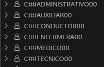

Podemos verificar que los usuarios fueron creados correctamente en la base de datos.

---
## Testing

* **Nota:** Queda pendiente el testeo de los demás perfiles, no los agregamos en este documento para evitar extenderlo demasiado con información redundante. Testar los demás perfiles debería seguir pasos similares.

### Usuario: C##medico00
La conexión se realiza con los mismos parámetros que en el paso 3 de la configuración inicial, pero hay que cambiar los datos de usuario y contraseña por los definidos en el script anterior para el usuario específico que se desea testar. En este caso:

```SQL
CREATE USER C##medico00 IDENTIFIED BY O7Qw5XUJiduTk;
```

---
1. Verificar conexión a la base de datos (consulta de todas las tablas)
```SQL
SELECT * FROM ALL_TABLES WHERE OWNER = 'SYSTEM';
```
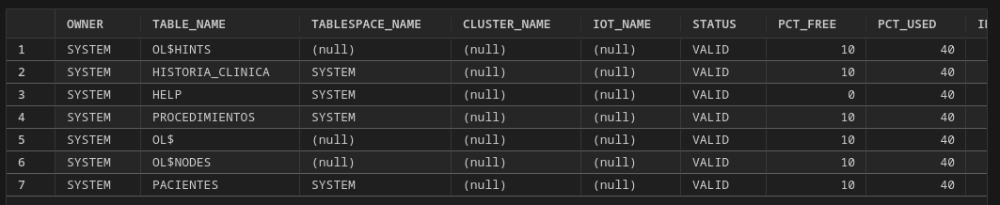
Si la conexión es exitosa, debería verse una lista de tablas como esa.

---
2. Verificar acceso a la tabla PACIENTES (debe poder consultar)
```SQL
SELECT * FROM SYSTEM.PACIENTES;
```

La tabla se muestra vacía porque aún no contiene datos.  Se comprueba que la consulta fue exitosa porque aparecen los campos de la tabla.

---
3. Probar inserción de datos en la tabla PACIENTES

Ingresar un nuevo paciente
```SQL
INSERT INTO SYSTEM.PACIENTES (paciente_id, nombre, apellido, fecha_nacimiento)
VALUES (1001, 'Carlos', 'Mendoza', TO_DATE('1985-07-15', 'YYYY-MM-DD'));
```
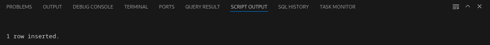

---
4. Confirmar que se haya insertado correctamente
```SQL
SELECT * FROM SYSTEM.PACIENTES WHERE paciente_id = 1001;
```
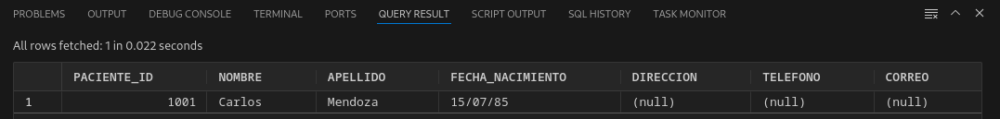

---
5. Probar acceso a la tabla HISTORIA_CLINICA (debe tener acceso a insertar y actualizar)
```SQL
INSERT INTO SYSTEM.HISTORIA_CLINICA (historia_id, paciente_id, fecha_ingreso, diagnostico, tratamiento)
VALUES (1001, 1001, TO_DATE('2024-12-18', 'YYYY-MM-DD'), 'Resfriado común', 'Reposo y líquidos');
```


---
6. Confirmar que se haya insertado correctamente
```SQL
SELECT * FROM SYSTEM.HISTORIA_CLINICA WHERE paciente_id = 1001;
```
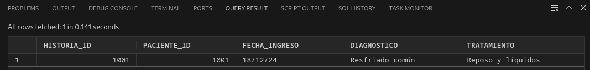

---
7. Insertar un procedimiento en la tabla PROCEDIMIENTOS
```SQL
INSERT INTO SYSTEM.PROCEDIMIENTOS (procedimiento_id, paciente_id, descripcion, fecha, costo)
VALUES (1, 1001, 'Exámenes de rutina', TO_DATE('2024-12-18', 'YYYY-MM-DD'), 150.00);
```


---
8. Verificar que el procedimiento se haya insertado correctamente
```SQL
SELECT * FROM SYSTEM.PROCEDIMIENTOS WHERE paciente_id = 1001;
```
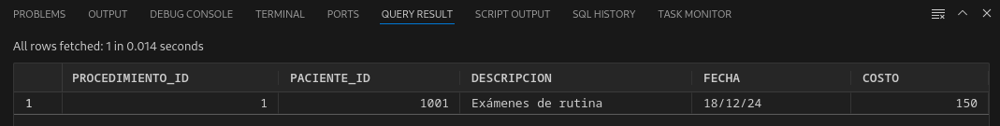

---
9. Probar actualización de datos en la tabla PROCEDIMIENTOS
```SQL
UPDATE SYSTEM.PROCEDIMIENTOS
SET costo = 200
WHERE paciente_id = 1001;
```


---
10. Confirmar que la actualización se realizó correctamente
```SQL
SELECT * FROM SYSTEM.PROCEDIMIENTOS WHERE paciente_id = 1001;
```
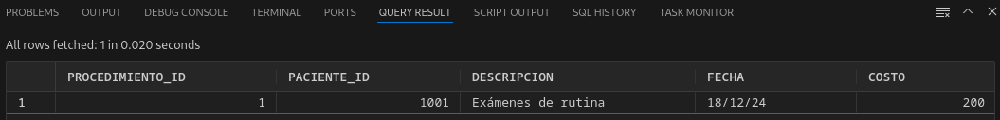

---
11. Probar eliminación de datos en la tabla PACIENTES
```SQL
DELETE FROM SYSTEM.PACIENTES WHERE paciente_id = 1001;
```
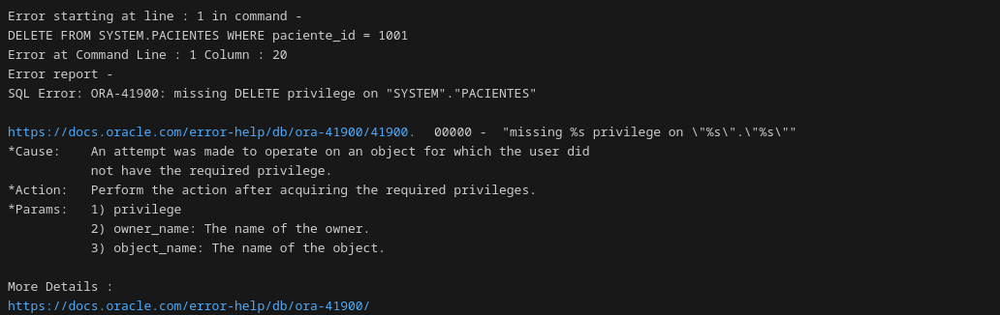
Tal como se espera, no nos permite borrar el paciente porque el usuario no tiene los permisos necesarios.

---
12. Probar el límite de sesiones simultáneas 

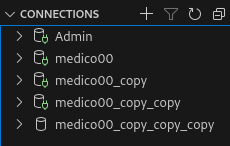
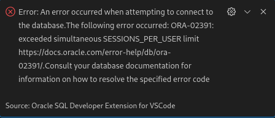

Al intentar realizar una cuarta conexión debería surgir un error como el de la imagen, ya que hemos configurado un máximo de tres sesiones simultáneas para este usuario.

## Referencias

1. Oracle. (n.d.). *Oracle Database Documentation*. Recuperado de https://docs.oracle.com/en/database/oracle/oracle-database/23/index.html

2. Oracle. (n.d.). *Oracle Container Registry*. Recuperado de https://container-registry.oracle.com/ords/f?p=113:4:105468287933418:::4:P4_REPOSITORY,AI_REPOSITORY,AI_REPOSITORY_NAME,P4_REPOSITORY_NAME,P4_EULA_ID,P4_BUSINESS_AREA_ID:1863,1863,Oracle%20Database%20Free,Oracle%20Database%20Free,1,0&cs=3AwzWwTBO9ge-PN-FJMP6CmQIpWJeaPM4t9K_xjdv0tus0fX1UchjuxAxgeVBrAvzu6mTDU_YC5ddFcwUKIiagg

4. Oracle. (n.d.). *Oracle SQL Developer Documentation*. Recuperado de https://docs.oracle.com/en/database/oracle/sql-developer/index.html

4. Oracle. (n.d.). *SQL Developer Dowloads*. Recuperado de https://www.oracle.com/cl/database/sqldeveloper/technologies/download/
